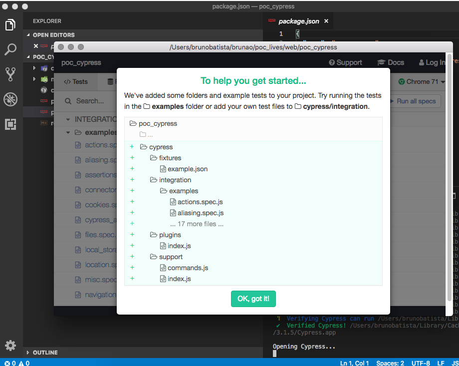

# Cypress poc

Vamos criar o arquivo descritor de um projeto e das dependencias

```
npm init
``` 

package name -- nome do pacote

version -- versao do projeto

description -- descricao do projeto

entry point -- um arquivo raiz

test command -- comando padrão(eu usei cypress open)

git repository -- link do github

keywords -- palavras chaves do projeto

author -- nome do autor

license -- licença ( eu coloquei MIT)


depois no final digita:

```
yes
```

## Intalando o cypress

```
npm install cypress --save-dev
```

* --save-dev usado para salvar o pacote para fins de desenvolvimento.

depois execute o comando:

```
npm run test
```
irá gera uma estrutura desta forma abaixo:

Poc_cypress

|__cypress
   |__fixtures
   |  |__example.json
   |__integration
   |   |__examples
   |__plugins
   |  |__index.js
   |__support
   |  |__command.js
   |  |__index.js
|__cypress.json
|__package-lock.json
|__package.json




depois exclua a pasta examples.

crie um arquivo na pasta integration chamado create_user.js

```
touch create_user.js
```

adicione os seguintes comandos

```
const UserPage = require("/Users/brunobatista/brunao/poc_lives/web/poc_cypress/cypress/integration/pageObjects/userPage.js");

describe('Create user', function () {
    before(function() {
        Cypress.on('uncaught:exception', (err, runnable) => { return false })
      });

  it('with success', function () {
    UserPage.visit();
    UserPage.createUser()

    cy.get('#notice').then(el => {
     expect(el.text()).to.eq('Usuário Criado com sucesso')
    })

  })
})
```

crie uma pasta  pageObjects e dentro dela crie um arquivo userPage.js

```
mkdir pageObjects
```

```
touch userPage.js
```

dentro do arquivo userPage.js adicione os seguintes comandos:

```
var faker = require('faker');

class UserPage {

  visit() {
    cy.visit('https://automacaocombatista.herokuapp.com/users/new')
  }

  createUser() {
    var name = faker.name.firstName();
    var last_name = faker.name.lastName();
    var email = faker.internet.email();
    var address = faker.address.streetName();
    var university = faker.company.companyName();
    var profile = faker.name.jobArea();
    var age = faker.random.number(100);

    cy.get('#user_name').type(name);
    cy.get('#user_lastname').type(last_name);
    cy.get('#user_email').type(email);
    cy.get('#user_address').type(address);
    cy.get('#user_university').type(university);
    cy.get('#user_profile').type(profile);
    cy.get('#user_gender').type('male');
    cy.get('#user_age').type(age);
    cy.get('input[value="Criar"]').click();
  }
}

module.exports = new UserPage();
```

agora so esta faltando instalar os pacotes standard e faker:

```
npm install faker --save-dev
```

```
npm install standard --save-dev
```

feito isso so rodar o comando 

```
npm run test 
```

e pronto projeto rodando :).